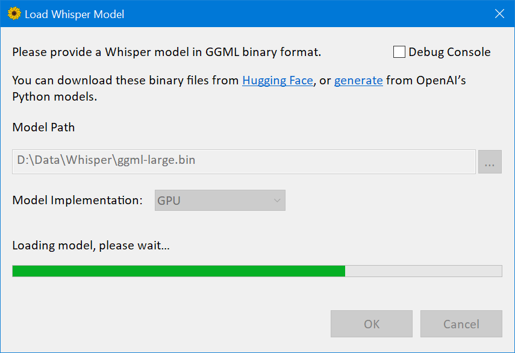
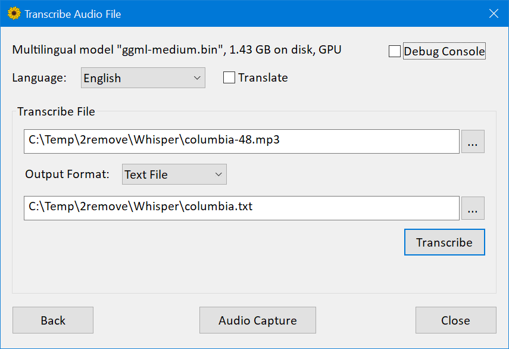
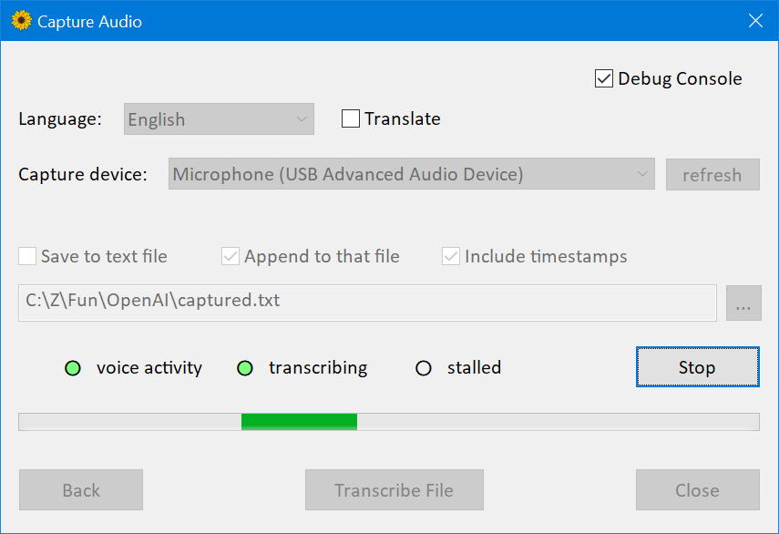

This project is a Windows port of the [whisper.cpp](https://github.com/ggerganov/whisper.cpp) implementation. 
Which in turn is a C++ port of [OpenAI's Whisper](https://github.com/openai/whisper) automatic speech recognition (ASR) model.

# Quick Start Guide

Download WhisperDesktop.zip from the “Releases” section of this repository, unpack the ZIP, and run WhisperDesktop.exe.

On the first screen it will ask you to download a model. 
I recommend `ggml-medium.bin` (1.42GB in size), because I’ve mostly tested the software with that model. 

The next screen allows to transcribe an audio file. 

There’s another screen which allows to capture and transcribe or translate live audio from a microphone. 

# Features

* Vendor-agnostic GPGPU based on DirectCompute; another name for that technology is “compute shaders in Direct3D 11”

* Plain C++ implementation, no runtime dependencies except essential OS components

* Much faster than OpenAI’s implementation. 
On my desktop computer with GeForce [1080Ti](https://en.wikipedia.org/wiki/GeForce_10_series#GeForce_10_(10xx)_series_for_desktops) GPU,
medium model, [3:24 min speech](https://upload.wikimedia.org/wikipedia/commons/1/1f/George_W_Bush_Columbia_FINAL.ogg)
took 45 seconds to transcribe with PyTorch and CUDA, but only 19 seconds with my implementation and DirectCompute. 
Funfact: that’s 9.63 gigabytes runtime dependencies, versus 431 kilobytes `Whisper.dll`

* Mixed F16 / F32 precision: Windows 
[requires support](https://learn.microsoft.com/en-us/windows/win32/direct3ddxgi/format-support-for-direct3d-feature-level-10-0-hardware#dxgi_format_r16_floatfcs-54)
of `R16_FLOAT` buffers since D3D version 10.0

* Built-in performance profiler which measures execution time of individual compute shaders

* Low memory usage

* Media Foundation for audio handling, supports most audio and video formats (with the notable exception of Ogg Vorbis),
and most audio capture devices which work on Windows (except some professional ones, which only implementing [ASIO](https://en.wikipedia.org/wiki/Audio_Stream_Input/Output) API).

* Voice activity detection for audio capture. 
The implementation is based on the [2009 article](https://www.researchgate.net/publication/255667085_A_simple_but_efficient_real-time_voice_activity_detection_algorithm)
“A simple but efficient real-time voice activity detection algorithm” by Mohammad Moattar and Mahdi Homayoonpoor.

* Easy to use COM-style API. Idiomatic C# wrapper [available on nuget](https://www.nuget.org/packages/WhisperNet/). 
Version 1.10 [introduced](https://github.com/Const-me/Whisper/tree/master/WhisperPS)
scripting support for PowerShell 5.1, that’s the older “Windows PowerShell” version which comes pre-installed on Windows.

* Pre-built binaries available

The only supported platform is 64-bit Windows. 
Should work on Windows 8.1 or newer, but I have only tested on Windows 10. 
The library requires a Direct3D 11.0 capable GPU, which in 2023 simply means “any hardware GPU”.
The most recent GPU without D3D 11.0 support was Intel [Sandy Bridge](https://en.wikipedia.org/wiki/Sandy_Bridge) from 2011.

On the CPU side, the library requires [AVX1](https://en.wikipedia.org/wiki/Advanced_Vector_Extensions) and [F16C](https://en.wikipedia.org/wiki/F16C) support.

# Developer Guide

## Build Instructions

1. Clone this repository

2. Open `WhisperCpp.sln` in Visual Studio 2022. I’m using the freeware community edition, version 17.4.4.

3. Switch to `Release` configuration

4. Build and run `CompressShaders` C# project, in the `Tools` subfolder of the solution.
To run that project, right click in visual studio, “Set as startup project”, then in the main menu of VS “Debug / Start Without Debugging”.
When completed successfully, you should see a console window with a line like that: 
`Compressed 46 compute shaders, 123.5 kb -> 18.0 kb`

5. Build `Whisper` project to get the native DLL, or `WhisperNet` for the C# wrapper and nuget package, or the examples.

## Other Notes

If you gonna consume the library in a software built with Visual C++ 2022 or newer, you probably redistribute Visual C++ runtime DLLs in the form of the `.msm` merge module,
or [vc_redist.x64.exe](https://learn.microsoft.com/en-us/cpp/windows/latest-supported-vc-redist?view=msvc-170) binary. 
If you do that, right click on the `Whisper` project, Properties, C/C++, Code Generation,
switch “Runtime Library” setting from `Multi-threaded (/MT)` to `Multi-threaded DLL (/MD)`,
and rebuild: the binary will become smaller.

The library includes [RenderDoc](https://renderdoc.org/) GPU debugger integration. 
When launched your program from RenderDoc, hold F12 key to capture the compute calls. 
If you gonna debug HLSL shaders, use the debug build of the DLL, it includes debug build of the shaders and you’ll get better UX in the debugger.

The repository includes a lot of code which was only used for development:
couple alternative model implementations, compatible FP64 versions of some compute shaders, debug tracing and the tool to compare the traces, etc. 
That stuff is disabled by preprocessor macros or `constexpr` flags, I hope it’s fine to keep here.

## Performance Notes

I have a limited selection of GPUs in this house. 
Specifically, I have optimized for nVidia 1080Ti, Radeon Vega 8 inside Ryzen 7 5700G, and Radeon Vega 7 inside Ryzen 5 5600U. 
[Here’s the summary](https://github.com/Const-me/Whisper/blob/master/SampleClips/summary.tsv).

The nVidia delivers relative speed 5.8 for the large model, 10.6 for the medium model. 
The AMD Ryzen 5 5600U APU delivers relative speed about 2.2 for the medium model. Not great, but still, much faster than realtime.

I have also tested on [nVidia 1650](https://en.wikipedia.org/wiki/GeForce_16_series#Desktop): slower than 1080Ti but pretty good, much faster than realtime. 
I have also tested on Intel HD Graphics 4000 inside Core i7-3612QM, the relative speed was 0.14 for medium model, 0.44 for small model.
That’s much slower than realtime, but I was happy to find my software works even on the integrated mobile GPU [launched](https://ark.intel.com/products/64901) in 2012.

I’m not sure the performance is ideal on discrete AMD GPUs, or integrated Intel GPUs, have not specifically optimized for them. 
Ideally, they might need slightly different builds of a couple of the most expensive compute shaders, `mulMatTiled.hlsl` and `mulMatByRowTiled.hlsl` 
And maybe other adjustments, like the `useReshapedMatMul()` value in `Whisper/D3D/device.h` header file.

I don’t know how to measure that, but I have a feeling the bottleneck is memory, not compute. 
Someone on Hacker News [has tested](https://news.ycombinator.com/item?id=34408429) on [3060Ti](https://en.wikipedia.org/wiki/GeForce_30_series#Desktop),
the version with GDDR6 memory.
Compared to 1080Ti, that GPU has 1.3x FP32 FLOPS, but 0.92x VRAM bandwidth.
The app was about 10% slower on the 3060Ti.

## Further Optimisations

I have only spent a few days optimizing performance of these shaders. 
It might be possible to do much better, here’s a few ideas.

* Newer GPUs like Radeon Vega or nVidia 1650 have higher FP16 performance compared to FP32, yet my compute shaders are only using FP32 data type. 
[Half The Precision, Twice The Fun](https://therealmjp.github.io/posts/shader-fp16/)

* In the current version, FP16 tensors are using shader resource views to upcast loaded values, and unordered access views to downcast stored ones. 
Might be a good idea to switch to [byte address buffers](https://learn.microsoft.com/en-us/windows/win32/direct3d11/direct3d-11-advanced-stages-cs-resources#byte-address-buffer),
load/store complete 4-bytes values, and upcast / downcast in HLSL with `f16tof32` / `f32tof16` intrinsics.

* In the current version all shaders are compiled offline, and `Whisper.dll` includes DXBC byte codes. 
The HLSL compiler `D3DCompiler_47.dll` is an OS component, and is pretty fast.
For the expensive compute shaders, it’s probably a good idea to ship HLSL instead of DXBC,
and [compile](https://learn.microsoft.com/en-us/windows/win32/api/d3dcompiler/nf-d3dcompiler-d3dcompile) on startup
with environment-specific [values](https://learn.microsoft.com/en-us/windows/win32/api/d3dcommon/ns-d3dcommon-d3d_shader_macro) for the macros.

* It might be a good idea to upgrade the whole thing from D3D11 to D3D12. 
The newer API is harder to use, but includes potentially useful features not exposed to D3D11:
[wave intrinsics](https://github.com/Microsoft/DirectXShaderCompiler/wiki/Wave-Intrinsics),
and [explicit FP16](https://github.com/microsoft/DirectXShaderCompiler/wiki/16-Bit-Scalar-Types).

## Missing Features

Automatic language detection is not implemented.

In the current version there’s high latency for realtime audio capture. 
Specifically, depending on voice detection the figure is about 5-10 seconds. 
At least in my tests, the model wasn’t happy when I supplied too short pieces of the audio. 
I have increased the latency and called it a day, but ideally this needs a better fix for optimal UX.

# Final Words

From my perspective, this is an unpaid hobby project, which I completed over the 2022-23 winter holydays. 
The code probably has bugs. 
The software is provided “as is”, without warranty of any kind.

Thanks to [Georgi Gerganov](https://github.com/ggerganov) for [whisper.cpp](https://github.com/ggerganov/whisper.cpp) implementation,
and the models in GGML binary format. 
I don’t program Python, and I don’t know anything about the ML ecosystem. 
I wouldn’t even start this project without a good C++ reference implementation, to test my version against.

That whisper.cpp project has an example which [uses](https://github.com/ggerganov/whisper.cpp/blob/master/examples/talk/gpt-2.cpp)
the same GGML implementation to run another OpenAI’s model, [GPT-2](https://en.wikipedia.org/wiki/GPT-2). 
It shouldn’t be hard to support that ML model with the compute shaders and relevant infrastructure already implemented in this project.

If you find this useful, I’ll be very grateful if you consider a donation to [“Come Back Alive” foundation](https://savelife.in.ua/en/).